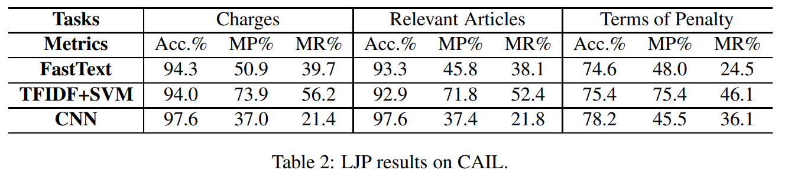

本项目旨在使用原生PyTorch统一实现法律判决预测LJP（legal judgment prediction）任务的当前各重要模型，包括对多种语言下多种数据的预处理、多种子任务下的实现。  
直接通过命令行即可调用torch_ljp/main.py文件，传入参数并得到对应的结果，需要预先在torch_ljp文件夹下创建config.py文件（由于真实文件涉及个人隐私，因此没有上传，但是我上传了一个fakeconfig.py文件，把里面需要填的参数填上就行）。  
具体的使用命令可参考example.txt。  
op_examples文件夹是输出示例，详细内容请参考具体文件。
模型的预测指标及其计算方式详见metrics文件夹中的介绍。
我所使用的系统环境中的重要版本见enviroment_v.txt所示。

以下分别介绍本项目中已经可实现分析和处理的数据，模型，及二者相对应的任务中，我跑出来的实验结果和原论文或其他引用论文中跑出来的结果的对比（有海量没整好的内容，等我慢慢补吧）：
（如果您希望我添加什么数据或模型，可以直接给我提issue！）
# 1. 数据
中文：
- [x] CAIL（又名CAIL2018数据集）（来源：[CAIL2018: A Large-Scale Legal Dataset for Judgment Prediction](https://arxiv.org/abs/1807.02478)，下载地址：<https://cail.oss-cn-qingdao.aliyuncs.com/CAIL2018_ALL_DATA.zip>）（在CAIL2018比赛中，原始任务是：以事实文本作为输入，以分类任务的范式，预测罪名（accusation）、法条（law）、刑期（imprisonment，单位为月，如被判为无期徒刑则是-1、死刑是-2）
- [ ] CAIL2021（来源：[Equality before the law: Legal judgment consistency analysis for fairness](https://arxiv.org/abs/2103.13868)，改自CAIL数据集。包含在FairLex中）
- [ ] LJP-E（还没有完全公开，我发邮件问过一作，他说会全部公开的。来源：[Legal Judgment Prediction via Event Extraction with Constraints](https://aclanthology.org/2022.acl-long.48/)）

英文（美国）：
- [ ] ILLDM（作者在论文里说要公开的，但是GitHub项目里还没有放出来。来源：[Interpretable Low-Resource Legal Decision Making](https://arxiv.org/abs/2201.01164)）

英文（欧洲）：
- [ ] ECHR（来源：[Neural Legal Judgment Prediction in English](https://arxiv.org/abs/1906.02059)，下载地址：<https://archive.org/download/ECHR-ACL2019/ECHR_Dataset.zip>。包含在LexGLUE中）
- [ ] ECtHR（来源：[Paragraph-level Rationale Extraction through Regularization: A case study on European Court of Human Rights Cases](https://aclanthology.org/2021.naacl-main.22/)，下载地址：[ecthr_cases · Datasets at Hugging Face](https://huggingface.co/datasets/ecthr_cases)。使用时同时需引用[Neural Legal Judgment Prediction in English](https://arxiv.org/abs/1906.02059)。包含在FairLex、LexGLUE中）

英文（印度）：
- [ ] ILSI（来源：[LeSICiN: A Heterogeneous Graph-Based Approach for Automatic Legal Statute Identification from Indian Legal Documents](https://arxiv.org/abs/2112.14731)，下载地址：[Dataset and additional files/softwares required for the paper "LeSICiN: A Heterogeneous Graph-based Approach for Automatic Legal Statute Identification from Indian Legal Documents" | Zenodo](https://zenodo.org/record/6053791#.YrAtHnZByUl)（除best_model.pt和ils2v.bin外都是数据相关的文件）

法语（比利时）：
- [ ] BSARD（来源：[A Statutory Article Retrieval Dataset in French](https://arxiv.org/abs/2108.11792)，下载地址：<https://raw.githubusercontent.com/maastrichtlawtech/bsard/master/data/bsard_v1.zip>）

多语言：
- [ ] Swiss-Judgment-Predict dataset（瑞士，德语、法语、意大利语，来源：[Swiss-Judgment-Prediction: A Multilingual Legal Judgment Prediction Benchmark](https://arxiv.org/abs/2110.00806)，下载地址1 [SwissJudgmentPrediction | Zenodo](https://zenodo.org/record/5529712#.YrKCJXZByUk)，下载地址2 [swiss_judgment_prediction · Datasets at Hugging Face](https://huggingface.co/datasets/swiss_judgment_prediction)。包含在FairLex中）

# 2. 模型
## 2.1 general-domain分类模型
- [ ] TFIDF+SVM（又名LibSVM）：定类数据，多分类单标签范式。（TFIDF来自[Term-weighting approaches in automatic text retrieval](https://www.scinapse.io/papers/1978394996)，SVM来自[Least Squares Support Vector Machine Classifiers](https://lirias.kuleuven.be/retrieve/88556)。[CAIL2018: A Large-Scale Legal Dataset for Judgment Prediction](https://arxiv.org/abs/1807.02478)使用的baseline。代码参考：[CAIL2018/baseline at master · thunlp/CAIL2018](https://github.com/thunlp/CAIL2018/tree/master/baseline)）
- [ ] FastText（[CAIL2018: A Large-Scale Legal Dataset for Judgment Prediction](https://arxiv.org/abs/1807.02478)使用的baseline）
- [ ] TextCNN（又名CNN）（来源：[Convolutional neural networks for sentence classification](https://arxiv.org/abs/1408.5882)，[CAIL2018: A Large-Scale Legal Dataset for Judgment Prediction](https://arxiv.org/abs/1807.02478)使用的baseline）
- [ ] LSTM（来源：[Long short-term memory](http://citeseerx.ist.psu.edu/viewdoc/download?doi=10.1.1.676.4320&rep=rep1&type=pdf)）
- [ ] GRU（来源：[Learning Phrase Representations using RNN Encoder-Decoder for Statistical Machine Translation](https://arxiv.org/abs/1406.1078))
- [ ] HAN（来源：[Hierarchical Attention Networks for Document Classification](https://aclanthology.org/N16-1174/)）
- [ ] RCNN（来源：[Recurrent Convolutional Neural Networks for Text Classification](https://www.aaai.org/ocs/index.php/AAAI/AAAI15/paper/download/9745/9552)）
- [ ] DPCNN（来源：[Deep Pyramid Convolutional Neural Networks for Text Categorization](https://aclanthology.org/P17-1052/)）
## 2.2 domain-specific分类模型
- [ ] FLA（来源：[Learning to Predict Charges for Criminal Cases with Legal Basis](https://aclanthology.org/D17-1289/)，LeSICiN使用的baseline）
- [ ] DAPM（来源：[Modeling Dynamic Pairwise Attention for Crime Classification over Legal Articles](https://dl.acm.org/doi/10.1145/3209978.3210057)，LeSICiN使用的baseline）
- [ ] HMN（来源：[Hierarchical Matching Network for Crime Classification](https://dl.acm.org/doi/10.1145/3331184.3331223)，LeSICiN使用的baseline）
- [ ] HBERT（来源：[Neural Legal Judgment Prediction in English](https://arxiv.org/abs/1906.02059)，LeSICiN使用的baseline）
- [ ] HLegalBERT（将HBERT中的BERT换成LegalBERT，LeSICiN使用的baseline）
- [ ] LADAN（来源：[Distinguish Confusing Law Articles for Legal Judgment Prediction](https://aclanthology.org/2020.acl-main.280/)，LeSICiN使用的baseline）
- [ ] LeSICiN（来源：[LeSICiN: A Heterogeneous Graph-Based Approach for Automatic Legal Statute Identification from Indian Legal Documents](https://arxiv.org/abs/2112.14731)）
- [ ] ILLDM（只能用在特殊数据里，但是GitHub项目里还没有放出所用的数据。来源：[Interpretable Low-Resource Legal Decision Making](https://arxiv.org/abs/2201.01164)）
- [ ] EPM（官方代码还没有完全公开，我发邮件问了一作他说他以后要全部公开的，所以我想等他们全部公开了再写。来源：[Legal Judgment Prediction via Event Extraction with Constraints](https://aclanthology.org/2022.acl-long.48/)）
## 2.3 general-domain回归模型
- [ ] 线性回归
## 2.4 inductive link prediction模型
- [ ] DEAL（来源：[Inductive Link Prediction for Nodes Having Only Attribute Information](https://arxiv.org/abs/2007.08053)，LeSICiN使用的baseline）

# 3. 实验结果
## 3.1 论文中原有的结果
### 3.1.1 CAIL数据集
#### [CAIL2018: A Large-Scale Legal Dataset for Judgment Prediction](https://arxiv.org/abs/1807.02478)
使用CAIL2018原始任务范式。

删除多被告情况，仅保留单一被告的案例；删除了出现频数低于30的罪名和法条；删除了不与特定罪名相关的102个法条（没看懂这句话是啥意思）。训练集是first_stage/train.json，测试集是 first_stage/test.json + restData/rest_data.json。用THULAC分词，Adam优化器，学习率为0.001，dropout rate是0.5，batch size是128

baseline：
①TFIDF+SVM（SVM是线性核，特征维度是5000，用skip-gram训练200维词向量）
②TextCNN（输入限长4096，filter widths是(2, 3, 4, 5)，filter size是64）
③FastText

指标：accuracy, macro-precision, macro-recall

实验结果：

## 3.2 我运行官方代码复现的结果
仅复现原文中的实验配置。
## 3.3 使用本项目代码复现的结果
实验配置见example.txt中的命令行。

其他注意事项：
1. torch_ljp/dataset_utils/other_data文件夹内放的是一些比较小，而且不太好解释怎么制作的文件，所以直接跟着GitHub项目一起上传了。
    1. cn_criminal_law.txt：2021版中华人民共和国刑法。复制自[中华人民共和国刑法（2022年最新版） - 中国刑事辩护网](http://www.chnlawyer.net/law/subs/xingfa.html)中下载的Word文件，并删除了其中语涉“中国刑事辩护网提供……”的字样。