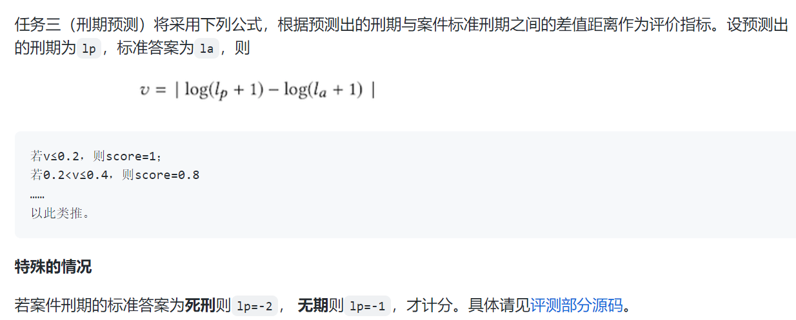

本文件夹主要用于放置计算LJP模型预测效果指标的相关代码。本README文件将对其进行介绍。

# 1. 分类任务
## 1.1 multi-class单标签任务
### 1.1.1 定类数据
示例：CAIL2018原始比赛中的罪名和法条预测任务（可参考[thunlp/CAIL: Chinese AI & Law Challenge](https://github.com/thunlp/CAIL)
1. accuracy
2. micro-F1
3. macro-precision
4. macro-recall
2. macro-F1
3. $\frac{micro\_F1+macro\_F1}{2}$（CAIL2018用的）
### 1.1.2 定序数据
示例：CAIL2018原始比赛中的刑期预测任务
1. log_distance（CAIL2018用的）

代码实现参考：
1. CAIL2018相关：[CAIL2018/judger.py at master · thunlp/CAIL2018](https://github.com/thunlp/CAIL2018/blob/master/judger/judger.py)，论文[Overview of CAIL2018: Legal Judgment Prediction Competition](https://arxiv.org/abs/1810.05851)